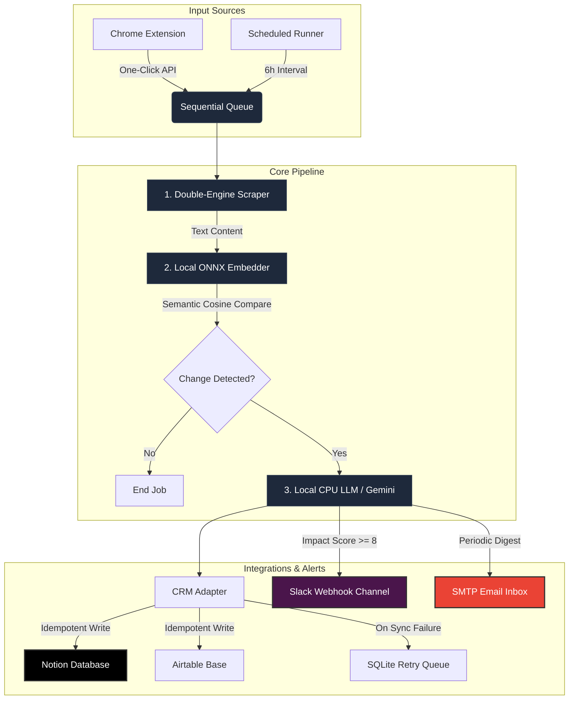

# 🕵️‍♂️ Autonomous Competitor Intelligence Engine

<div align="center">

[](https://notion.so)
[](https://slack.com)
[](mailto:)
[](https://huggingface.co)
[](https://huggingface.co)

</div>

---

### 🌟 Project Overview
The **Autonomous Competitor Intelligence Engine** is a fully automated, self-contained competitor monitoring workspace that runs entirely inside a CPU-bound, low-memory environment (optimized for Railway's 512MB RAM free tier). It schedules scraping, compares page edits **semantically** (stripping out headers, footers, and cookie banners to avoid false positives), generates risk/impact scores using a local CPU LLM or Google Gemini, and synchronizes real-time reports to **Notion** or **Airtable** with full idempotency checks.

---

## 🗺️ System Architecture & Workflow



---

## ⚡ Core Technical Features

<details open>
<summary><b>📡 1. Intelligent Double-Engine Scraper (Enrichment Source 1)</b></summary>

*   **Fast Fetch Engine**: Uses standard Axios + Cheerio requests for static layouts.
*   **JS-Heavy Render Engine**: Uses Puppeteer (with styles/images blocked to save resources) to parse dynamic client-side applications.
*   **Anti-Bot & Clean Parser**: Strips out variable layouts (cookie popups, sidebars, headers, footers) to target only relevant content, avoiding false positives.
*   **Visual Snapshot**: Saves screenshot captures of scraping runs to a local `/screenshots` path served statically.
</details>

<details>
<summary><b>🔍 2. Tech Stack & DNS Lookup (Enrichment Source 2)</b></summary>

*   **DNS Resolution**: Checks A and MX records dynamically to inspect server location and email server hosting.
*   **Header Inspection**: Reads HTTP server response headers (e.g., `server`, `x-powered-by`) to map competitor server frameworks.
*   **Dashboard Sidebar**: Displays enriched server technology profiles directly beside competitor listings.
</details>

<details>
<summary><b>🤖 3. Local ONNX Semantic Matching</b></summary>

*   **Embedding Pipeline**: Runs `all-MiniLM-L6-v2` locally using `@huggingface/transformers` in ONNX format.
*   **Text Comparison**: Computes paragraph-level cosine similarity vector differences. Cosmetic shifts (such as a random date string or footer link) do not trigger LLM calls, ensuring resource efficiency.
</details>

<details>
<summary><b>🧠 4. Optimized Subprocess LLM Runner</b></summary>

*   **Subprocess Memory Isolation**: Instead of running GGUF LLMs in-process (which causes memory leak issues and crash spikes in Node.js), it launches a standard C++ `llama-cli` binary.
*   **Instant RAM Release**: Memory used for AI inference is immediately reclaimed by the OS the millisecond analysis finishes.
*   **Platform Auto-Installer**: On boot, the server queries the GitHub API to download the precompiled `llama-cli` executable tailored to your host OS (Linux/macOS) and downloads the 382MB model file from Hugging Face.
</details>

<details>
<summary><b>💼 5. Idempotent CRM Sync & Fail-Safe Queue</b></summary>

*   **Double-Write Protection**: Before writing to Notion or Airtable, the adapter queries the database to match titles and URLs, preventing duplicate writes.
*   **SQLite Retry Queue**: If your Notion token expires or is temporarily disconnected, failed sync cards are saved in a local SQLite table (`crm_queue`) and auto-retried at periodic intervals.
</details>

---

## 🤖 Machine Learning & LLM Configurations

Choose between cloud-hosted inference (Google Gemini) and a fully offline setup:

### Option A: Google Gemini API (Recommended for Cloud / Railway)
Set `GEMINI_API_KEY=your_key` in your `.env` file to run analysis remotely.
*   **Model**: `gemini-2.5-flash`
*   **RAM Footprint**: ~0 MB (Network API call)
*   **Inference Speed**: < 1.5 seconds

### Option B: Local CPU-Bound LLM (100% Offline Fallback)
If no Gemini API key is defined, the engine runs locally on CPU:

| Component | Model Name | Format | Model Size | RAM Footprint | Inference Speed |
| :--- | :--- | :--- | :--- | :--- | :--- |
| **Embeddings** | `Xenova/all-MiniLM-L6-v2` | ONNX | ~90 MB | ~80 MB | < 0.5 seconds |
| **Local LLM** | `Qwen/Qwen2.5-0.5B-Instruct` | GGUF (Q4_K_M) | ~382 MB | ~350 MB | 7–15s on shared CPU |

---

## 🚀 Local Setup & Installation

### Prerequisites
*   Node.js (v18+)
*   NPM (v10+)
*   macOS, Linux (or Windows via WSL)

### 1. Clone & Install
```bash
# Clone the repository
git clone https://github.com/your-username/acie.git
cd acie

# Install all components (Root, server, client)
npm install
npm run install:all
```

### 2. Configure Environment Variables
Create a `.env` file in the root directory:
```env
PORT=3000
NODE_ENV=development
GEMINI_API_KEY=AIzaSyCC...  # Optional: For Gemini cloud inference
```

### 3. Run Development Servers
Start both backend (Port 3000) and frontend (Port 5173) concurrently:
```bash
npm run dev
```
Open **`http://localhost:5173`** to access the dashboard workspace.

### 4. Running Integration Tests
Verify scraping, embedding, LLM pipelines, and CRM integration locally:
```bash
npm test
```

---

## 🔌 Integration Setup Guides

<details>
<summary><b>🗒️ Notion CRM Configuration (Recommended)</b></summary>

1. Create a Notion integration token at **[Notion My Integrations](https://www.notion.so/my-integrations)**.
2. In your Notion Workspace, create a Database page named **Competitor Intel** and define the following properties exactly:
   *   **Title** &rarr; Type: `Title` (the default first column)
   *   **Competitor Name** &rarr; Type: `Select`
   *   **URL** &rarr; Type: `URL`
   *   **Category** &rarr; Type: `Select`
   *   **Impact Score** &rarr; Type: `Number`
   *   **Recommended Action** &rarr; Type: `Text` (or Rich Text)
   *   **Summary** &rarr; Type: `Text` (or Rich Text)
   *   **Justification** &rarr; Type: `Text` (or Rich Text)
   *   **Screenshot URL** &rarr; Type: `URL`
3. Click the `...` menu on the top right of your database page, go to **Connect to**, search for your integration, and click confirm.
4. Copy the URL of your database page and extract the **Database ID** (the 32-character string between the last `/` and the `?`).
5. Open your dashboard at `http://localhost:5173`, click **Settings**, select **Notion** as active CRM, and save your Token and Database ID.
</details>

<details>
<summary><b>📊 Airtable CRM Configuration</b></summary>

1. Generate a Personal Access Token (PAT) with `data.records:write` scopes at **[Airtable Developer Hub](https://airtable.com/create/tokens)**.
2. Create a Base and a Table named **Competitor Intel** with the following fields:
   *   `Title` (Single line text)
   *   `Competitor Name` (Single line text)
   *   `URL` (URL)
   *   `Category` (Single line text)
   *   `Summary` (Long text)
   *   `Justification` (Long text)
   *   `Impact Score` (Number)
   *   `Recommended Action` (Single line text)
   *   `Screenshot URL` (URL)
   *   `Timestamp` (Single line text)
3. Enter your Base ID, Table name, and Token in the settings panel of your dashboard and save.
</details>

<details>
<summary><b>🧩 Chrome Extension Setup (One-Click Registration)</b></summary>

1. Open Chrome and navigate to **`chrome://extensions/`**.
2. Enable **Developer mode** in the top right corner.
3. Click **Load unpacked** in the top left and select the `extension/` directory of this project.
4. Click the extension icon in your toolbar, then select **Configure Server Settings**.
5. Set your server connection URL (e.g., `http://localhost:3000`) and paste the **Extension API Key** (found in your web app Settings tab).
6. Click **Verify and Save**. Now you can register competitors with a single click while browsing!
</details>

<details>
<summary><b>📢 Slack Alerts Webhook</b></summary>

1. Create an Incoming Webhook in your Slack Workspace settings.
2. In the web dashboard Settings panel, input the **Slack Webhook URL**.
3. Any competitor change detected with an **Impact Score >= 8** will trigger an immediate alert message to your Slack channel!
</details>

<details>
<summary><b>📧 SMTP Email Configuration</b></summary>

1. Set up your SMTP server details in the Settings panel. For Gmail, use an **App Password** (`security.google.com` -> App Passwords).
2. Set provider to `smtp`, enter host `smtp.gmail.com`, port `587`, your email, the app password, and a recipient address.
3. Save configurations and click **Test SMTP Connection** to receive a verification email. Periodic digests will now land directly in your inbox.
</details>

---

## 🛠️ Deployment on Railway

The repository includes a production-ready `Dockerfile` optimized to deploy everything in one click:
1. Create a **New Project** on Railway.
2. Link your GitHub repository.
3. Railway reads the `Dockerfile`, handles Chrome installations for scraping, downloads standard binaries, builds static Vite client assets, and exposes standard Express routing.
4. Add the `PORT` environment variable set to `3000`.

---

## ⚠️ Known Limitations & Resource Strategies

*   **Binary Downloader Delay**: On first boot or initial run, the system requires a couple of minutes to fetch the local quantized models and precompiled GGUF runner. Subsequent scans execute instantly.
*   **Anti-Bot Protections**: Some highly secure platforms block headless web scrapers. The system handles this gracefully by extracting text payload fallbacks from pure Axios requests if Puppeteer triggers bot alerts.
*   **Concurrency Queue**: To maintain a memory footprint under 512MB, competitor sites are crawled and analyzed in a strict queue. If many competitors are running, updates will resolve sequentially.

---

<div align="center">
  <sub>Developed by Advanced Agentic Coding. Open source under MIT License.</sub>
</div>
