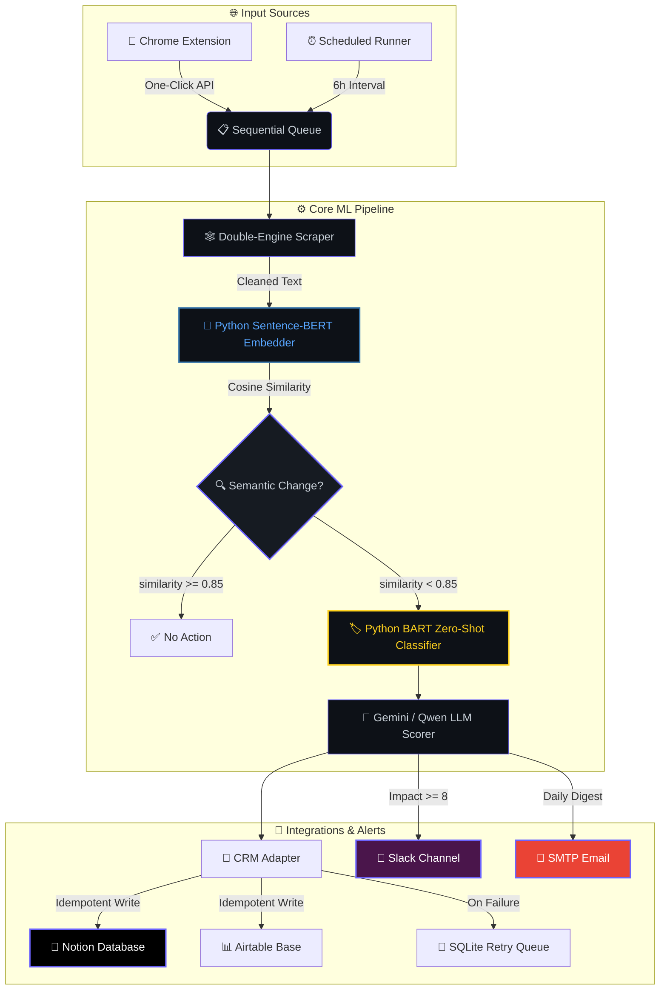

<div align="center">

<!-- Animated Typing SVG Header -->


<br/>

<!-- Animated Wave Divider -->


<br/>

<!-- Animated Shield Badges -->
[](https://python.org)
[](https://nodejs.org)
[](https://react.dev)
[](https://huggingface.co)

[](https://notion.so)
[](https://slack.com)
[](mailto:)
[](https://developer.chrome.com)

<br/>

<!-- Animated Stats Line -->


</div>

<br/>

<!-- Gradient Divider -->


## 🌟 What Is This?

> **An autonomous, self-healing competitor monitoring engine** that scrapes competitor websites on a schedule, detects *meaningful* content changes using **Python ML sentence embeddings**, classifies them via **zero-shot deep learning**, scores business impact with **LLM inference**, and pushes real-time alerts to **Slack**, **Email**, and **Notion/Airtable CRM** — all within a **512MB RAM** footprint.

<br/>

<div align="center">

| 🔬 Scrape | 🧠 Detect | 🏷️ Classify | 📊 Score | 🚨 Alert |
|:---:|:---:|:---:|:---:|:---:|
| Axios + Puppeteer | Python Sentence-BERT | BART Zero-Shot NLI | Gemini / Qwen LLM | Slack + Email + CRM |
| Double-engine static & JS rendering | `all-MiniLM-L6-v2` cosine similarity | `facebook/bart-large-mnli` | Impact scoring 1–10 | Real-time webhook push |

</div>

<br/>


## 🗺️ System Architecture



<br/>


## 🧬 The ML Pipeline — Deep Dive

<table>
<tr>
<td width="50%">

### 🐍 Stage 1 — Semantic Change Detection
**Python** • `sentence-transformers` • `all-MiniLM-L6-v2`

```python
from sentence_transformers import SentenceTransformer
from sklearn.metrics.pairwise import cosine_similarity

model = SentenceTransformer("all-MiniLM-L6-v2")

old_embedding = model.encode("Price is $100")
new_embedding = model.encode("Current Price: $100")

similarity = cosine_similarity(
    [old_embedding], [new_embedding]
)[0][0]
# → 0.93 — Same meaning, NO alert! ✅
```

> ❌ **No string comparison** — the system understands *meaning*, not characters.

</td>
<td width="50%">

### 🏷️ Stage 2 — Zero-Shot Change Classification
**Python** • `transformers` • `facebook/bart-large-mnli`

```python
from transformers import pipeline

classifier = pipeline(
    "zero-shot-classification",
    model="facebook/bart-large-mnli"
)

result = classifier(
    "We launched GPT Vision.",
    candidate_labels=[
        "Pricing Change", "Feature Update",
        "Hiring Signal", "Content Shift",
        "Leadership Change", "Other"
    ]
)
# → "Feature Update" (0.87 confidence) 🎯
```

> ❌ **No rule-based `if "price":`** — uses deep learning NLI.

</td>
</tr>
</table>

### 🧠 Stage 3 — LLM Impact Analysis & Scoring

The classified change is fed to either **Google Gemini 2.5 Flash** (cloud) or a **local Qwen2.5-0.5B GGUF** model (CPU). The LLM generates:

| Output | Description |
|:---|:---|
| 📂 **Category** | Overridden by BART zero-shot classifier output |
| 📝 **Summary** | One-paragraph plain-English summary of what changed |
| ❓ **Why It Matters** | Business impact analysis relative to *your* company profile |
| 📊 **Impact Score** | Integer 1–10 threat/opportunity rating |
| 📋 **Justification** | Evidence-based reasoning for the score |
| 🎯 **Recommendation** | Specific action item with timeline |

<br/>


## ⚡ Core Feature Modules

<details open>
<summary><b>🕸️ 1. Intelligent Double-Engine Scraper</b></summary>
<br/>

| Engine | Library | Purpose |
|:---|:---|:---|
| ⚡ Fast Fetch | `axios` + `cheerio` | Static HTML pages — fast and lightweight |
| 🌐 JS Render | `puppeteer` (headless Chromium) | SPAs, React/Angular apps with dynamic content |

**Smart Cleaning Pipeline:**
- 🧹 Strips cookie banners, navigation bars, footers, sidebars
- 🔄 Rotates User-Agent strings to avoid bot detection
- 🖼️ Blocks images/CSS in Puppeteer to minimize memory footprint
- 📸 Captures visual screenshots for audit trails

</details>

<details>
<summary><b>🔍 2. Tech Stack & DNS Enrichment</b></summary>
<br/>

- 🌐 **DNS Resolution** — A-records and MX-records for server & email hosting detection
- 🔧 **Header Inspection** — Reads `server`, `x-powered-by`, `x-generator` HTTP headers
- 📊 **Dashboard Widget** — Shows enriched tech profiles directly in the competitor sidebar

</details>

<details>
<summary><b>💼 3. Idempotent CRM Sync & Fail-Safe Queue</b></summary>
<br/>

- 🔒 **Deduplication** — Queries Notion/Airtable before writes to prevent duplicates
- 🔄 **SQLite Retry Queue** — Failed syncs are queued locally and auto-retried periodically
- 📊 **Dynamic Schema Matching** — Case-insensitive, whitespace-tolerant property matching
- ✅ **Status Tracking** — Each card tracks `synced`, `failed`, or `pending` state

</details>

<details>
<summary><b>📢 4. Multi-Channel Alert System</b></summary>
<br/>

| Channel | Trigger | Content |
|:---|:---|:---|
| 💬 **Slack** | Impact Score ≥ 8 | Immediate webhook with full intelligence card |
| 📧 **Email** | Periodic digest schedule | HTML-formatted summary of all recent changes |
| 📓 **Notion** | Every detected change | Structured database row with all fields |
| 📊 **Airtable** | Every detected change | Structured record with all fields |

</details>

<details>
<summary><b>🧩 5. Chrome Extension — One-Click Registration</b></summary>
<br/>

- 🖱️ Browse any competitor website → Click extension icon → **Instantly registered**
- 🔑 Secured via API key authentication
- 🔗 Connects to your running server instance
- ⚡ Zero-friction competitor onboarding workflow

</details>

<br/>


## 🤖 ML Model Configurations

<div align="center">

| Component | Model | Format | Size | RAM | Speed |
|:---|:---|:---|:---|:---|:---|
| 🔍 **Semantic Embeddings** | `all-MiniLM-L6-v2` | ONNX / PyTorch | ~90 MB | ~80 MB | < 0.5s |
| 🏷️ **Zero-Shot Classifier** | `facebook/bart-large-mnli` | PyTorch | ~1.6 GB | ~1.2 GB | ~6s |
| 🧠 **LLM (Cloud)** | `gemini-2.5-flash` | API | 0 MB | 0 MB | < 1.5s |
| 🧠 **LLM (Local)** | `Qwen2.5-0.5B-Instruct` | GGUF Q4_K_M | ~382 MB | ~350 MB | 7–15s |

</div>

> 💡 **Tip:** Set `GEMINI_API_KEY` in `.env` for cloud inference. Without it, the engine falls back to the local Qwen GGUF model automatically.

<br/>


## 🚀 Quick Start

### Prerequisites

```
✅ Node.js    v18+
✅ Python     3.9+
✅ NPM        v10+
✅ OS         macOS / Linux / Windows (WSL)
```

### 1️⃣ Clone & Install

```bash
# Clone the repository
git clone https://github.com/NitheshK4/Autonomous-Competitor-Intelligence-Engine.git
cd Autonomous-Competitor-Intelligence-Engine

# Install Node.js dependencies (root, server, client)
npm install
npm run install:all

# Install Python ML dependencies
pip install sentence-transformers transformers torch
```

### 2️⃣ Configure Environment

Create a `.env` file in the project root:

```env
PORT=3000
NODE_ENV=development

# Optional: Cloud LLM inference (recommended)
GEMINI_API_KEY=AIzaSyCC...

# Optional: Slack real-time alerts
SLACK_WEBHOOK_URL=https://hooks.slack.com/services/...
```

### 3️⃣ Launch Development Servers

```bash
npm run dev
```

> 🖥️ **Backend** → `http://localhost:3000`
> 🎨 **Dashboard** → `http://localhost:5173`

### 4️⃣ Run Integration Tests

```bash
npm test
```

Validates: Scraping → Semantic Detection → LLM Inference → Zero-Shot Classification → CRM Sync

<br/>


## 🔌 Integration Setup Guides

<details>
<summary><b>📓 Notion CRM Configuration</b></summary>
<br/>

1. Create an integration at **[Notion My Integrations](https://www.notion.so/my-integrations)**
2. Create a Database with these properties:

| Property | Type |
|:---|:---|
| Title | `Title` (default) |
| Competitor Name | `Select` |
| URL | `URL` |
| Category | `Select` |
| Impact Score | `Number` |
| Recommended Action | `Text` |
| Summary | `Text` |
| Justification | `Text` |
| Screenshot URL | `URL` |

3. Connect your integration to the database via the `...` menu → **Connect to**
4. Extract your **Database ID** from the page URL
5. Enter credentials in the dashboard **Settings** panel

</details>

<details>
<summary><b>📊 Airtable CRM Configuration</b></summary>
<br/>

1. Generate a PAT with `data.records:write` at **[Airtable Developer Hub](https://airtable.com/create/tokens)**
2. Create a Base → Table named **Competitor Intel** with matching fields
3. Enter Base ID, Table name, and Token in dashboard Settings

</details>

<details>
<summary><b>🧩 Chrome Extension Setup</b></summary>
<br/>

1. Navigate to `chrome://extensions/`
2. Enable **Developer mode** → Click **Load unpacked**
3. Select the `extension/` directory from this project
4. Configure server URL and API key in extension settings
5. Browse any site → Click extension → **Competitor registered!** 🎉

</details>

<details>
<summary><b>💬 Slack Alerts</b></summary>
<br/>

1. Create an **Incoming Webhook** in your Slack workspace
2. Paste the webhook URL in dashboard Settings
3. Changes with **Impact Score ≥ 8** trigger instant Slack alerts! ⚡

</details>

<details>
<summary><b>📧 SMTP Email Digest</b></summary>
<br/>

1. For Gmail: Generate an **App Password** at `security.google.com`
2. Configure in Settings: Host `smtp.gmail.com`, Port `587`
3. Click **Test SMTP Connection** to verify
4. Periodic digests will arrive in your inbox automatically 📬

</details>

<br/>


## 🐳 Deploy on Railway

```bash
# Railway reads the Dockerfile and handles everything:
# ✅ Chrome installation for Puppeteer
# ✅ Model binary downloads
# ✅ Vite static build
# ✅ Express server routing
```

1. Create a **New Project** on [Railway](https://railway.app)
2. Link your GitHub repository
3. Add environment variable: `PORT=3000`
4. Deploy! 🚀

<br/>


## 🛠️ Tech Stack

<div align="center">


</div>

<br/>

| Layer | Technologies |
|:---|:---|
| 🐍 **ML Engine** | Python, sentence-transformers, HuggingFace Transformers, PyTorch |
| 🖥️ **Backend** | Node.js, Express, better-sqlite3, node-cron |
| 🎨 **Frontend** | React, Vite, Recharts, React Router |
| 🕸️ **Scraping** | Axios, Cheerio, Puppeteer (headless Chromium) |
| 🧠 **AI/LLM** | Gemini 2.5 Flash, Qwen2.5-0.5B GGUF, BART-large-MNLI |
| 🔌 **Integrations** | Notion API, Airtable API, Slack Webhooks, Nodemailer SMTP |
| 🧩 **Extension** | Chrome Manifest V3, Background Service Workers |

<br/>


## 📁 Project Structure

```
📦 Autonomous-Competitor-Intelligence-Engine
├── 📂 client/                    # React + Vite frontend dashboard
│   ├── 📂 src/
│   │   ├── 📂 components/        # Dashboard, Settings, Cards UI
│   │   ├── 📂 pages/             # Route pages
│   │   └── App.jsx               # Root application
│   └── vite.config.js
├── 📂 server/                    # Node.js + Express backend
│   └── 📂 src/
│       ├── scraper.js            # Double-engine web scraper
│       ├── detector.js           # Semantic change detection orchestrator
│       ├── semantic_detector.py  # 🐍 Python sentence-BERT embeddings
│       ├── zero_shot_classifier.py # 🐍 Python BART zero-shot classifier
│       ├── llm.js                # LLM inference (Gemini / Qwen GGUF)
│       ├── crm.js                # Notion & Airtable CRM adapter
│       ├── queue.js              # Sequential processing queue
│       ├── slack.js              # Slack webhook alerts
│       ├── email.js              # SMTP email digest
│       └── db.js                 # SQLite database layer
├── 📂 extension/                 # Chrome Extension (Manifest V3)
├── analytics.py                  # 🐍 CLI analytics dashboard & reports
├── Dockerfile                    # Production container config
├── package.json                  # Root workspace orchestrator
└── README.md                     # ← You are here! 📍
```

<br/>


## ⚠️ Known Limitations

| Issue | Details |
|:---|:---|
| ⏳ **Cold Start** | First run downloads ML models (~1.6GB for BART, ~382MB for Qwen). Subsequent runs use cache. |
| 🤖 **Anti-Bot** | Some sites block headless scrapers. The engine falls back to Axios gracefully. |
| 📋 **Sequential Queue** | Competitors are processed one-at-a-time to stay under 512MB RAM. |
| 🏷️ **Classifier Latency** | BART zero-shot takes ~6s per classification on CPU. Cached after first load. |

<br/>

<!-- Animated Footer Wave -->


<div align="center">


<br/><br/>

[](LICENSE)

</div>
