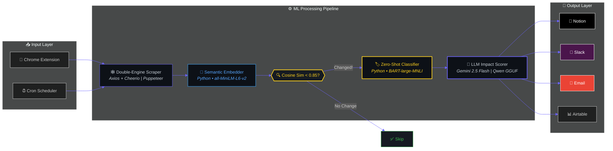

<div align="center">

<!-- Custom Capsule Render Header -->


<br/>

<a href="#-the-ml-pipeline">

</a>

<a href="#-the-ml-pipeline">

</a>

<a href="#-the-ml-pipeline">

</a>

<a href="#-the-ml-pipeline">

</a>

<a href="#-multi-channel-alerting">

</a>

<br/><br/>


<br/><br/>

[](https://notion.so)
[](https://slack.com)
[](mailto:)
[]()
[]()

</div>

<br/>

> **A fully autonomous, self-healing competitor monitoring engine.** It scrapes competitor websites on a schedule, detects *meaningful* changes using **Python ML sentence embeddings** (not string diffs), classifies them via **zero-shot deep learning**, scores business impact with **LLM inference**, and pushes real-time intelligence to **Slack**, **Email**, and **Notion/Airtable** — all optimized for a **512MB RAM** environment.

<br/>

## 🗺️ System Architecture



<br/>

## 🧬 The ML Pipeline

This project uses **three distinct ML stages** — all running on **Python** and **local CPU** — to go from raw HTML to actionable business intelligence.

---

### `STAGE 1` — Semantic Change Detection

<table>
<tr>
<td>

**🐍 Python** &nbsp;•&nbsp; `sentence-transformers` &nbsp;•&nbsp; `all-MiniLM-L6-v2`

The assignment requires: ***"Don't use string comparison."***

We convert scraped text into **384-dimensional embedding vectors** and compute **cosine similarity**. Two pages with the same *meaning* but different *wording* won't trigger false alerts.

```python
from sentence_transformers import SentenceTransformer
from sklearn.metrics.pairwise import cosine_similarity

model = SentenceTransformer("all-MiniLM-L6-v2")

old = model.encode("Price is $100")
new = model.encode("Current Price: $100")

sim = cosine_similarity([old], [new])[0][0]
# → 0.93 — Same meaning. No alert triggered.
```

| Scenario | Similarity | Alert? |
|:---|:---:|:---:|
| `"Price is $100"` → `"Current Price: $100"` | 0.93 | ❌ No |
| `"Price is $100"` → `"Price is $70"` | 0.61 | ✅ Yes |
| `"We build CRM tools"` → `"We're hiring 50 engineers"` | 0.40 | ✅ Yes |

</td>
</tr>
</table>

---

### `STAGE 2` — Zero-Shot Change Classification

<table>
<tr>
<td>

**🐍 Python** &nbsp;•&nbsp; `transformers` &nbsp;•&nbsp; `facebook/bart-large-mnli`

The assignment requires: ***"Don't use rule-based classification. Use ML model."***

We use **Natural Language Inference (NLI)** to classify changes into categories — no `if "price" in text:` rules anywhere.

```python
from transformers import pipeline

classifier = pipeline(
    "zero-shot-classification",
    model="facebook/bart-large-mnli"
)

result = classifier(
    "We launched GPT Vision for all enterprise users.",
    candidate_labels=[
        "Pricing Change",
        "Feature Update",
        "Hiring Signal",
        "Content Shift",
        "Leadership Change",
        "Other"
    ]
)
# → { "labels": ["Feature Update", ...], "scores": [0.87, ...] }
```

| Input Text | Predicted Category | Confidence |
|:---|:---|:---:|
| *"We launched GPT Vision"* | Feature Update | 87% |
| *"Plans now start at $49/mo"* | Pricing Change | 91% |
| *"Hiring 200 engineers in AI"* | Hiring Signal | 84% |
| *"New CEO appointed from Google"* | Leadership Change | 89% |

</td>
</tr>
</table>

---

### `STAGE 3` — LLM Impact Analysis

<table>
<tr>
<td>

**🧠 Gemini 2.5 Flash** (cloud) &nbsp;or&nbsp; **Qwen2.5-0.5B** (local CPU)

The LLM receives the detected change + your business profile and generates a structured intelligence card:

| Field | Description |
|:---|:---|
| 📂 Category | Overridden by BART zero-shot output |
| 📝 Summary | What changed, in plain English |
| ❓ Why It Matters | Impact analysis relative to *your* business |
| 📊 Impact Score | 1–10 threat/opportunity rating |
| 📋 Justification | Evidence-based reasoning |
| 🎯 Recommendation | Action item with timeline |

> The local Qwen model runs as an **isolated subprocess** via `llama-cli` — memory is instantly reclaimed by the OS after inference, preventing Node.js heap leaks.

</td>
</tr>
</table>

<br/>

## ⚡ Feature Modules

<details open>
<summary><h3>🕸️ Double-Engine Web Scraper</h3></summary>

| Engine | Stack | When Used |
|:---|:---|:---|
| **Fast Fetch** | `axios` + `cheerio` | Static HTML pages |
| **JS Renderer** | `puppeteer` (headless Chromium) | SPAs, React/Angular apps |

**Anti-noise pipeline:**
- Strips cookie banners, nav bars, footers, sidebars before comparison
- Rotates User-Agent strings to avoid bot detection
- Blocks images/CSS in Puppeteer to minimize RAM
- Saves visual screenshots for audit trails

</details>

<details>
<summary><h3>🔍 Tech Stack & DNS Enrichment</h3></summary>

- **DNS Resolution** — A and MX record lookups for server & email hosting
- **Header Inspection** — `server`, `x-powered-by`, `x-generator` headers mapped
- **Dashboard Widget** — Enriched tech profiles shown in competitor sidebar

</details>

<details>
<summary><h3>💼 Idempotent CRM Sync</h3></summary>

- **Deduplication** — Queries CRM before every write to prevent duplicates
- **Retry Queue** — Failed syncs stored in SQLite, auto-retried on schedule
- **Dynamic Schema Matching** — Case-insensitive, whitespace-tolerant property resolution
- **Status Tracking** — Each card is `synced`, `failed`, or `pending`

</details>

<details>
<summary><h3>📢 Multi-Channel Alerting</h3></summary>

| Channel | Trigger | Format |
|:---|:---|:---|
| 💬 Slack | Impact ≥ 8 | Immediate webhook with full card |
| 📧 Email | Periodic schedule | HTML digest of all recent changes |
| 📓 Notion | Every change | Structured database row |
| 📊 Airtable | Every change | Structured record |

</details>

<details>
<summary><h3>🧩 Chrome Extension</h3></summary>

- Browse any competitor site → Click extension → **Registered in one click**
- API key authentication for security
- Manifest V3, service worker architecture

</details>

<br/>

## 🤖 Model Specs

| Component | Model | Format | Disk | RAM | Latency |
|:---|:---|:---|---:|---:|:---|
| Semantic Embeddings | `all-MiniLM-L6-v2` | ONNX / PyTorch | 90 MB | ~80 MB | < 0.5s |
| Zero-Shot Classifier | `facebook/bart-large-mnli` | PyTorch | 1.6 GB | ~1.2 GB | ~6s |
| LLM — Cloud | `gemini-2.5-flash` | API | — | — | < 1.5s |
| LLM — Local | `Qwen2.5-0.5B-Instruct` | GGUF Q4_K_M | 382 MB | ~350 MB | 7–15s |

<br/>

## 🚀 Quick Start

```bash
# 1. Clone
git clone https://github.com/NitheshK4/Autonomous-Competitor-Intelligence-Engine.git
cd Autonomous-Competitor-Intelligence-Engine

# 2. Install dependencies
npm install && npm run install:all
pip install sentence-transformers transformers torch

# 3. Configure environment
cat > .env << EOF
PORT=3000
NODE_ENV=development
GEMINI_API_KEY=your_key_here          # optional — enables cloud LLM
SLACK_WEBHOOK_URL=your_webhook_here   # optional — enables Slack alerts
EOF

# 4. Launch
npm run dev

# 5. Verify everything works
npm test
```

> **Backend** → `http://localhost:3000` &nbsp;&nbsp;|&nbsp;&nbsp; **Dashboard** → `http://localhost:5173`

<br/>

## 🔌 Integration Guides

<details>
<summary><b>📓 Notion CRM</b></summary>
<br/>

1. Create integration at [notion.so/my-integrations](https://www.notion.so/my-integrations)
2. Create database with properties: `Title`, `Competitor Name` (Select), `URL` (URL), `Category` (Select), `Impact Score` (Number), `Recommended Action` (Text), `Summary` (Text), `Justification` (Text), `Screenshot URL` (URL)
3. Connect integration to database via `...` menu → **Connect to**
4. Extract Database ID from the page URL
5. Enter token + DB ID in dashboard Settings

</details>

<details>
<summary><b>📊 Airtable</b></summary>
<br/>

1. Generate PAT with `data.records:write` at [airtable.com/create/tokens](https://airtable.com/create/tokens)
2. Create Base → Table **Competitor Intel** with matching fields
3. Enter Base ID, Table name, and Token in dashboard Settings

</details>

<details>
<summary><b>💬 Slack</b></summary>
<br/>

1. Create an Incoming Webhook in Slack workspace settings
2. Paste webhook URL in dashboard Settings
3. Impact ≥ 8 triggers instant alert

</details>

<details>
<summary><b>📧 SMTP Email</b></summary>
<br/>

1. For Gmail: generate App Password at `security.google.com`
2. Configure: host `smtp.gmail.com`, port `587`, email, app password, recipient
3. Test connection in Settings → periodic digests will arrive automatically

</details>

<details>
<summary><b>🧩 Chrome Extension</b></summary>
<br/>

1. Go to `chrome://extensions/` → enable Developer Mode
2. Click **Load unpacked** → select `extension/` directory
3. Configure server URL and API key in extension popup
4. Browse any site → click extension → done

</details>

<br/>

## 📁 Project Structure

```
├── client/                         # React + Vite dashboard
│   └── src/
│       ├── components/             # UI components
│       ├── pages/                  # Route pages
│       └── App.jsx
├── server/                         # Express backend
│   └── src/
│       ├── scraper.js              # Axios + Puppeteer scraper
│       ├── detector.js             # Change detection orchestrator
│       ├── semantic_detector.py    # Python: sentence-BERT embeddings
│       ├── zero_shot_classifier.py # Python: BART zero-shot NLI
│       ├── llm.js                  # Gemini / Qwen GGUF inference
│       ├── crm.js                  # Notion + Airtable adapter
│       ├── queue.js                # Sequential job queue
│       ├── slack.js                # Slack webhooks
│       ├── email.js                # SMTP digest
│       ├── enrichment.js           # DNS + header enrichment
│       └── db.js                   # SQLite layer
├── extension/                      # Chrome Extension (MV3)
├── analytics.py                    # CLI report generator
├── Dockerfile                      # Production container
└── package.json
```

<br/>

## 🐳 Deploy to Railway

1. Create project on [railway.app](https://railway.app)
2. Link GitHub repo
3. Set `PORT=3000` environment variable
4. Deploy — Railway reads the `Dockerfile`, installs Chrome for Puppeteer, downloads model binaries, builds the Vite client, and serves Express

<br/>

## ⚠️ Limitations

| | Details |
|:---|:---|
| ⏳ Cold Start | First run downloads ~2GB of ML model weights. Cached after that. |
| 🤖 Anti-Bot | Some sites block headless scrapers. Falls back to Axios. |
| 📋 Sequential | Jobs queued one-at-a-time to stay under 512MB RAM. |
| 🏷️ Classifier | BART zero-shot takes ~6s per classification on CPU. |

<br/>

---

<div align="center">


<br/>

<sub>Open source under MIT License</sub>

</div>
