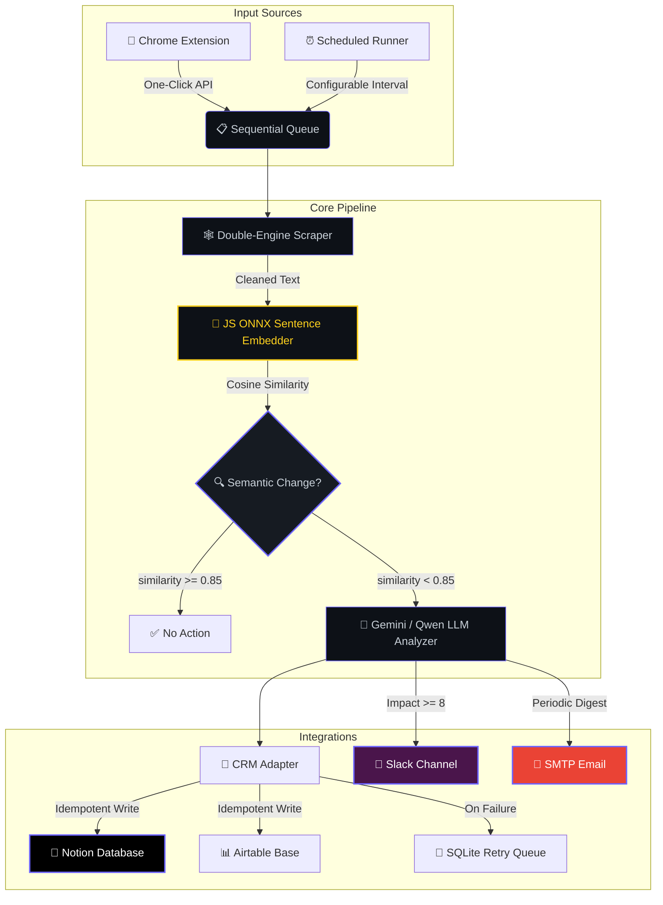
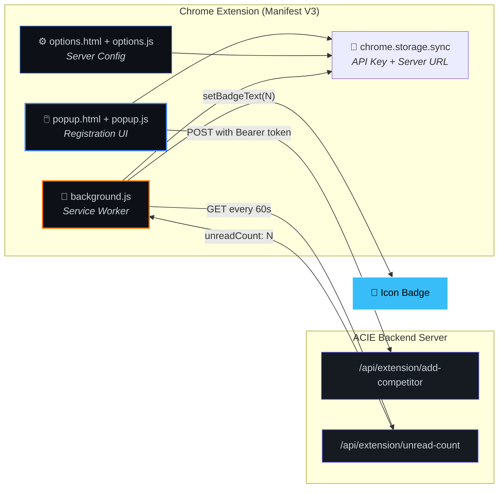

<div align="center">

<!-- Animated Typing SVG Header -->


<br/>

<!-- Animated Wave Divider -->


<br/>

<!-- Animated Shield Badges -->
[](https://nodejs.org)
[](https://react.dev)
[](https://huggingface.co)
[](https://ai.google.dev)

[](https://notion.so)
[](https://slack.com)
[](mailto:)
[](https://developer.chrome.com)

<br/>

<!-- Animated Stats Line -->


</div>

<br/>

<!-- Gradient Divider -->


## 🌟 What Is This?

> **An autonomous, self-healing competitor monitoring engine** that scrapes competitor websites on a schedule, detects *meaningful* content changes using **JavaScript ONNX sentence embeddings**, analyzes and scores business impact with **Gemini 2.5 Flash** (or a local **Qwen GGUF** fallback), and pushes real-time alerts to **Slack**, **Email**, and **Notion/Airtable CRM** — all within a **512MB RAM** footprint.

<br/>

<div align="center">

| 🔬 Scrape | 🧠 Detect | 📊 Analyze & Score | 🚨 Alert |
|:---:|:---:|:---:|:---:|
| Axios + Puppeteer | JS ONNX Sentence Embeddings | Gemini 2.5 Flash / Qwen GGUF | Slack + Email + CRM |
| Double-engine static & JS rendering | `Xenova/all-MiniLM-L6-v2` cosine similarity | LLM classification + impact scoring 1–10 | Real-time webhook push |

</div>

<br/>


## 🗺️ System Architecture



<br/>


## 🧬 The ML Pipeline — Deep Dive

<table>
<tr>
<td width="50%">

### 🧠 Stage 1 — Semantic Change Detection
**JavaScript** • `@huggingface/transformers` • `Xenova/all-MiniLM-L6-v2` (ONNX)

```javascript
const { pipeline } = require('@huggingface/transformers');

const embedder = await pipeline(
  'feature-extraction',
  'Xenova/all-MiniLM-L6-v2'
);

const oldEmbed = await embedder("Price is $100",
  { pooling: 'mean', normalize: true });
const newEmbed = await embedder("Current Price: $100",
  { pooling: 'mean', normalize: true });

// Cosine similarity → 0.93 — Same meaning, NO alert! ✅
```

> ❌ **No string comparison** — the system understands *meaning*, not characters.

</td>
<td width="50%">

### 📊 Stage 2 — LLM Analysis, Classification & Scoring
**Node.js** • `Gemini 2.5 Flash API` / `Qwen2.5-0.5B GGUF`

The detected changes are fed to **Google Gemini 2.5 Flash** (cloud) or a **local Qwen2.5-0.5B GGUF** model (via llama-cli, CPU). The LLM generates:

| Output | Description |
|:---|:---|
| 📂 **Category** | LLM-determined change type |
| 📝 **Summary** | One-paragraph plain-English summary |
| ❓ **Why It Matters** | Business impact analysis |
| 📊 **Impact Score** | Integer 1–10 threat/opportunity rating |
| 📋 **Justification** | Evidence-based reasoning |
| 🎯 **Recommendation** | Specific action item with timeline |

> 💡 **No zero-shot classifier** — the LLM handles both classification and scoring in a single inference pass.

</td>
</tr>
</table>

### 🔄 Fallback Chain

When cloud or local LLM inference is unavailable (rate limits, cold starts), a **rule-based heuristic engine** kicks in. It uses keyword matching on the diff text to assign categories (pricing change, hiring signal, product update, leadership change) and approximate impact scores.

```
Gemini 2.5 Flash API → Qwen2.5-0.5B GGUF (llama-cli) → Rule-Based Heuristic Fallback
```

<br/>


## 🧩 Chrome Extension — One-Click Competitor Tracking

<div align="center">

[]()
[]()
[]()

</div>

<br/>

The **ACIE Chrome Extension** turns your browser into a competitor registration tool. Browse any competitor's website, click the extension icon, and it's instantly added to the monitoring engine — no need to open the dashboard.

### ⚡ Extension Features

| Feature | How It Works |
|:---|:---|
| 🖱️ **One-Click Registration** | Auto-detects the active tab's URL and guesses the competitor name from the domain. Click "Add Competitor" and it's queued for scraping. |
| 🔴 **Live Unread Badge** | A background service worker polls the server every 60 seconds. When new intelligence cards are detected, a bright cyan badge count appears on the extension icon. |
| 🔑 **API Key Authentication** | All requests are secured with a `Bearer` token. Configure your server URL and API key in the Options page. |
| ⚙️ **Options Page** | Dedicated settings UI to configure the backend server URL and verify your API key connection before use. |
| 🎯 **Scope Selector** | Choose monitoring scope directly from the popup: full website, pricing page, or specific section. |

### 🏗️ Extension Architecture



### 📂 Extension File Structure

```
📦 extension/
├── manifest.json          # Manifest V3 config — permissions, icons, service worker
├── popup.html             # Main popup UI — competitor registration form
├── popup.js               # Popup logic — auto-fills URL, sends POST to backend
├── options.html           # Settings page — server URL & API key configuration
├── options.js             # Options logic — save/verify connection settings
├── background.js          # Service worker — polls unread count, updates badge
├── generate_icons.js      # Icon generation utility
├── icon16.png             # Toolbar icon (16×16)
├── icon48.png             # Extension management icon (48×48)
└── icon128.png            # Chrome Web Store icon (128×128)
```

### 🔧 Extension Installation

```bash
# 1. Open Chrome extensions page
chrome://extensions/

# 2. Enable "Developer mode" (top-right toggle)

# 3. Click "Load unpacked" → select the extension/ directory

# 4. Click the extension icon in toolbar → "Configure Server Settings"

# 5. Enter your server URL (e.g., http://localhost:3000)
#    and the Extension API Key (found in dashboard Settings tab)

# 6. Click "Verify and Save" — you're ready to go!
```

> 💡 **How it works:** When you click "Add Competitor", the extension sends a `POST` request to `/api/extension/add-competitor` with the URL, competitor name, and scope. The backend instantly adds it to the database and enqueues the first scraping job. Meanwhile, the background service worker watches for new intelligence cards and lights up the badge counter!

<br/>


## ⚡ Core Feature Modules

<details open>
<summary><b>🕸️ 1. Intelligent Double-Engine Scraper</b></summary>
<br/>

| Engine | Library | Purpose |
|:---|:---|:---|
| ⚡ Fast Fetch | `axios` + `cheerio` | Static HTML pages — fast and lightweight |
| 🌐 JS Render | `puppeteer` (headless Chromium) | SPAs, React/Angular apps with dynamic content |

**Smart Cleaning Pipeline:**
- 🧹 Strips cookie banners, navigation bars, footers, sidebars
- 🔄 Rotates User-Agent strings to avoid bot detection
- 🖼️ Blocks images/CSS in Puppeteer to minimize memory footprint
- 📸 Captures visual screenshots for audit trails

</details>

<details>
<summary><b>🔍 2. Tech Stack & DNS Enrichment</b></summary>
<br/>

- 🌐 **DNS Resolution** — A-records and MX-records for server & email hosting detection
- 🔧 **Header Inspection** — Reads `server`, `x-powered-by` HTTP headers
- 📊 **Dashboard Widget** — Shows enriched tech profiles directly in the competitor sidebar

</details>

<details>
<summary><b>💼 3. Idempotent CRM Sync & Fail-Safe Queue</b></summary>
<br/>

- 🔒 **Deduplication** — Queries Notion/Airtable before writes to prevent duplicates
- 🔄 **SQLite Retry Queue** — Failed syncs are queued locally and auto-retried periodically
- 📊 **Dynamic Schema Matching** — Case-insensitive, whitespace-tolerant property matching
- ✅ **Status Tracking** — Each card tracks `synced`, `failed`, or `pending` state

</details>

<details>
<summary><b>📢 4. Multi-Channel Alert System</b></summary>
<br/>

| Channel | Trigger | Content |
|:---|:---|:---|
| 💬 **Slack** | Impact Score ≥ 8 | Immediate webhook with full intelligence card |
| 📧 **Email** | Periodic digest schedule | HTML-formatted summary of all recent changes |
| 📓 **Notion** | Every detected change | Structured database row with all fields |
| 📊 **Airtable** | Every detected change | Structured record with all fields |

</details>

<br/>


## 🤖 Model Configurations

<div align="center">

| Component | Model | Runtime | Size | RAM | Speed |
|:---|:---|:---|:---|:---|:---|
| 🔍 **Semantic Embeddings** | `Xenova/all-MiniLM-L6-v2` | `@huggingface/transformers` (ONNX, JS) | ~90 MB | ~80 MB | < 0.5s |
| 🧠 **LLM (Cloud)** | `gemini-2.5-flash` | Google Generative Language API | 0 MB | 0 MB | < 1.5s |
| 🧠 **LLM (Local)** | `Qwen2.5-0.5B-Instruct` | llama-cli (GGUF Q4_K_M) | ~382 MB | ~350 MB | 7–15s |
| 🔧 **Fallback** | Rule-based heuristic | Node.js keyword matching | 0 MB | 0 MB | < 1ms |

</div>

> 💡 **Tip:** Set `GEMINI_API_KEY` in `.env` for cloud inference. Without it, the engine falls back to the local Qwen GGUF model automatically. If both fail, a rule-based heuristic handles analysis.

<br/>


## 🚀 Quick Start

### Prerequisites

```
✅ Node.js    v18+
✅ NPM        v10+
✅ OS         macOS / Linux / Windows (WSL)
```

### 1️⃣ Clone & Install

```bash
# Clone the repository
git clone https://github.com/NitheshK4/Autonomous-Competitor-Intelligence-Engine.git
cd Autonomous-Competitor-Intelligence-Engine

# Install Node.js dependencies (root, server, client)
npm install
npm run install:all
```

> 💡 No Python setup required! All ML inference runs natively in Node.js via ONNX or external binaries.

### 2️⃣ Configure Environment

Create a `.env` file in the project root:

```env
PORT=3000
NODE_ENV=development

# Optional: Cloud LLM inference (recommended)
GEMINI_API_KEY=AIzaSyCC...

# Optional: Slack real-time alerts
SLACK_WEBHOOK_URL=https://hooks.slack.com/services/...
```

### 3️⃣ Launch Development Servers

```bash
npm run dev
```

> 🖥️ **Backend** → `http://localhost:3000`
> 🎨 **Dashboard** → `http://localhost:5173`

### 4️⃣ Run Integration Tests

```bash
npm test
```

Validates: Scraping → Semantic Detection → LLM Inference → CRM Sync

<br/>


## 🔌 Integration Setup Guides

<details>
<summary><b>📓 Notion CRM Configuration</b></summary>
<br/>

1. Create an integration at **[Notion My Integrations](https://www.notion.so/my-integrations)**
2. Create a Database with these properties:

| Property | Type |
|:---|:---|
| Title | `Title` (default) |
| Competitor Name | `Select` |
| URL | `URL` |
| Category | `Select` |
| Impact Score | `Number` |
| Recommended Action | `Text` |
| Summary | `Text` |
| Justification | `Text` |
| Screenshot URL | `URL` |

3. Connect your integration to the database via the `...` menu → **Connect to**
4. Extract your **Database ID** from the page URL
5. Enter credentials in the dashboard **Settings** panel

</details>

<details>
<summary><b>📊 Airtable CRM Configuration</b></summary>
<br/>

1. Generate a PAT with `data.records:write` at **[Airtable Developer Hub](https://airtable.com/create/tokens)**
2. Create a Base → Table named **Competitor Intel** with matching fields
3. Enter Base ID, Table name, and Token in dashboard Settings

</details>

<details>
<summary><b>💬 Slack Alerts</b></summary>
<br/>

1. Create an **Incoming Webhook** in your Slack workspace
2. Paste the webhook URL in dashboard Settings
3. Changes with **Impact Score ≥ 8** trigger instant Slack alerts! ⚡

</details>

<details>
<summary><b>📧 SMTP Email Digest</b></summary>
<br/>

1. For Gmail: Generate an **App Password** at `security.google.com`
2. Configure in Settings: Host `smtp.gmail.com`, Port `587`
3. Click **Test SMTP Connection** to verify
4. Periodic digests will arrive in your inbox automatically 📬

</details>

<br/>


## 🛠️ Tech Stack

<div align="center">


</div>

<br/>

| Layer | Technologies |
|:---|:---|
| 🖥️ **Backend** | Node.js, Express, SQLite (`sqlite3` + `sqlite`), UUID |
| 🎨 **Frontend** | React 18, Vite 5 |
| 🕸️ **Scraping** | Axios, Cheerio, Puppeteer (headless Chromium) |
| 🧠 **AI/ML** | `@huggingface/transformers` (ONNX embeddings), Gemini 2.5 Flash API, Qwen2.5-0.5B GGUF (llama-cli) |
| 🔌 **Integrations** | Notion API (`@notionhq/client`), Airtable API (REST), Slack Webhooks, Nodemailer SMTP |
| 🧩 **Extension** | Chrome Manifest V3, Service Workers, `chrome.storage` API |
| 🔧 **Tooling** | Concurrently, Nodemon, Docker |

<br/>


## 📁 Project Structure

```
📦 Autonomous-Competitor-Intelligence-Engine
├── 📂 client/                        # React + Vite frontend dashboard
│   ├── 📂 src/
│   │   ├── App.jsx                   # Root application (single-file dashboard)
│   │   ├── index.css                 # Global styles
│   │   └── main.jsx                  # React entry point
│   ├── index.html                    # HTML template
│   └── vite.config.js                # Vite configuration
├── 📂 server/                        # Node.js + Express backend
│   └── 📂 src/
│       ├── index.js                  # Express server, API routes, scheduler
│       ├── scraper.js                # Double-engine web scraper (Axios + Puppeteer)
│       ├── detector.js               # Semantic change detection (ONNX embeddings)
│       ├── llm.js                    # LLM inference (Gemini API / Qwen GGUF / fallback)
│       ├── crm.js                    # Notion & Airtable CRM adapter
│       ├── queue.js                  # Sequential processing queue
│       ├── slack.js                  # Slack webhook alerts
│       ├── mailer.js                 # SMTP email digest (Nodemailer)
│       ├── enrichment.js             # DNS + header tech stack enrichment
│       ├── db.js                     # SQLite database layer
│       └── verify-test.js            # Integration test suite
├── 📂 extension/                     # 🧩 Chrome Extension (Manifest V3)
│   ├── manifest.json                 # MV3 config — permissions & service worker
│   ├── popup.html / popup.js         # One-click competitor registration UI
│   ├── options.html / options.js     # Server URL & API key settings
│   ├── background.js                 # Service worker — badge polling
│   └── icon*.png                     # Extension icons (16, 48, 128)
├── data_exporter.py                  # 🐍 Standalone CSV export utility (Python stdlib only)
├── Dockerfile                        # Production container config
├── package.json                      # Root workspace orchestrator
└── README.md                         # ← You are here! 📍
```

<br/>


## 🐳 Deployment on Railway

```bash
# Railway reads the Dockerfile and handles everything:
# ✅ Chrome installation for Puppeteer
# ✅ Model binary downloads (ONNX + GGUF)
# ✅ Vite static build
# ✅ Express server routing
```

1. Create a **New Project** on [Railway](https://railway.app)
2. Link your GitHub repository
3. Add environment variable: `PORT=3000`
4. Deploy! 🚀

<br/>


## ⚠️ Known Limitations

| Issue | Details |
|:---|:---|
| ⏳ **Cold Start** | First run downloads ML models (~90MB for ONNX embeddings, ~382MB for Qwen GGUF). Subsequent runs use cache. |
| 🤖 **Anti-Bot** | Some sites block headless scrapers. The engine falls back to Axios gracefully. |
| 📋 **Sequential Queue** | Competitors are processed one-at-a-time to stay under 512MB RAM. |
| 🔄 **LLM Rate Limits** | Gemini API may rate-limit under heavy use. Auto-falls back to local Qwen GGUF, then to heuristic analysis. |

<br/>

<!-- Animated Footer Wave -->


<div align="center">

[](LICENSE)

</div>
