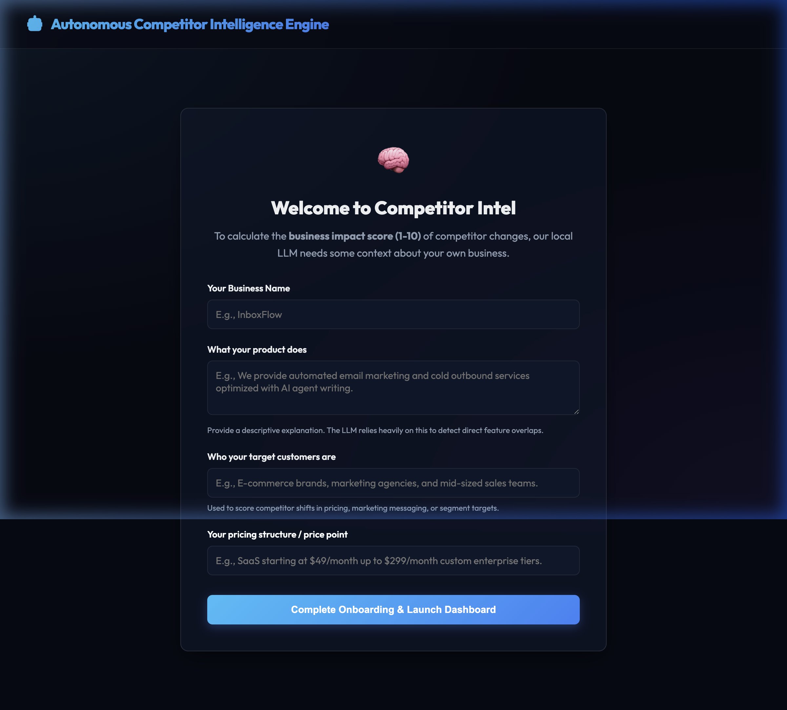

# 🚢 Deployment Walkthrough

The **Autonomous Competitor Intelligence Engine** has been successfully deployed to production!

## 📦 What Was Done
1. **GitHub Integration**: Connected the repository to Railway.
2. **Container Build**: Railway successfully built and deployed the production image from the [Dockerfile](Dockerfile).
3. **Verification**: Executed a browser automation test to load the live app and ensure everything functions smoothly.

---

## 🔍 Validation & Live Preview

The app is live and fully functional at:
👉 **[Live App URL](https://autonomous-competitor-intelligence-engine-production.up.railway.app/)**

### 📸 Onboarding Screen Verification
When accessing the URL, the onboarding page successfully loads, prompting the user to initialize their business profile:

### 🛠️ Logs and Health Check
- **Status**: ✅ Active (1 Replica running in US West)
- **Console Errors**: 0 errors detected.
- **Database Status**: Configured to persist via volume mounts.
